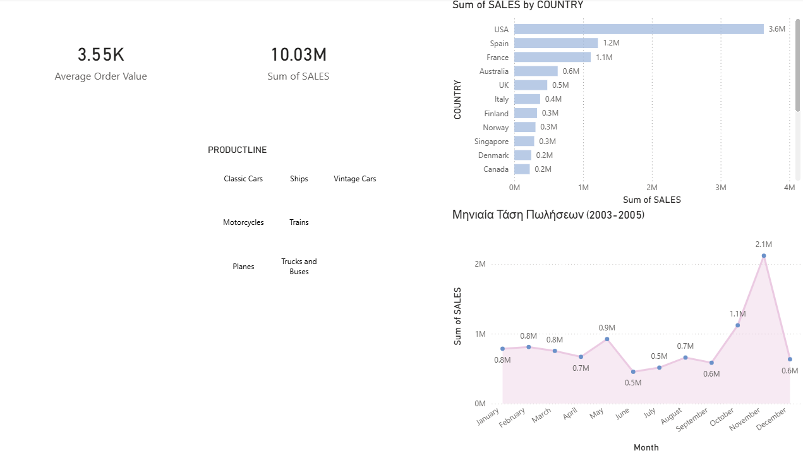

# Sales Dashboard Analysis (SQL & Power BI)

## Περιγραφή Project
Αυτό το project εστιάζει στην ανάλυση ιστορικών δεδομένων πωλήσεων από ένα e-shop μοντελισμού. Ο στόχος ήταν η εξαγωγή χρήσιμων συμπερασμάτων (Business Insights) σχετικά με την εποχικότητα, τις κορυφαίες αγορές και την απόδοση των προϊόντων.

## Tech Stack
- **SQL (SQLite):** Για τον καθαρισμό και την προετοιμασία των δεδομένων (Data Transformation).
- **Power BI:** Για τη δημιουργία διαδραστικών αναφορών και Data Modeling.
- **DAX:** Για τον υπολογισμό Key Performance Indicators (KPIs).
- **Python:** Για το αρχικό data ingestion και SQL scripting.

## Βασικά Ερωτήματα που Απαντήθηκαν
1. **Ποιος είναι ο συνολικός τζίρος;** (10.03M)
2. **Υπάρχει εποχικότητα;** Παρατηρήθηκε τεράστια αύξηση κάθε Νοέμβριο (περίπου 2.12M), λόγω προετοιμασίας για την εορταστική περίοδο.
3. **Ποια είναι η κορυφαία κατηγορία;** Τα Classic Cars ηγούνται της αγοράς με τζίρο 3.92M.
4. **Ποιες είναι οι top αγορές;** USA, Spain και France αποτελούν το "Elite" group με πωλήσεις >1M η κάθε μία.

## Χαρακτηριστικά Dashboard
- **Interactive Map:** Οπτικοποίηση πωλήσεων ανά χώρα με bubble size ανάλογα με τον τζίρο.
- **Monthly Trend Line Chart:** Παρακολούθηση της πορείας των πωλήσεων από το 2003 έως το 2005.
- **Dynamic Slicers:** Φιλτράρισμα ολόκληρου του report ανά κατηγορία προϊόντος (Product Line).
- **Custom DAX Measures:** Υπολογισμός Average Order Value (AOV).

## Screenshots

---
